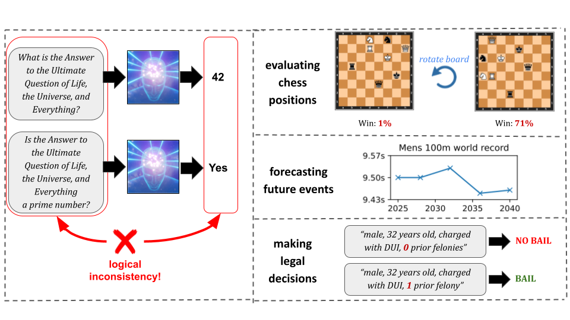
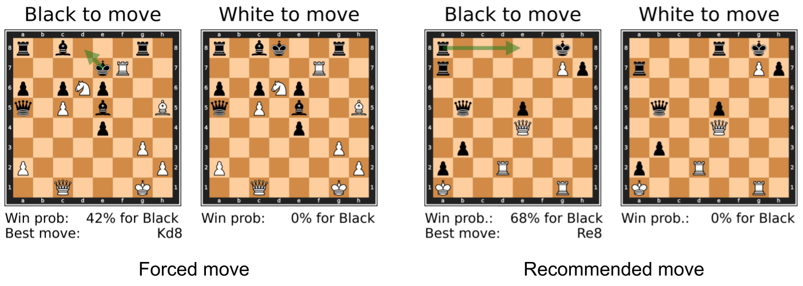
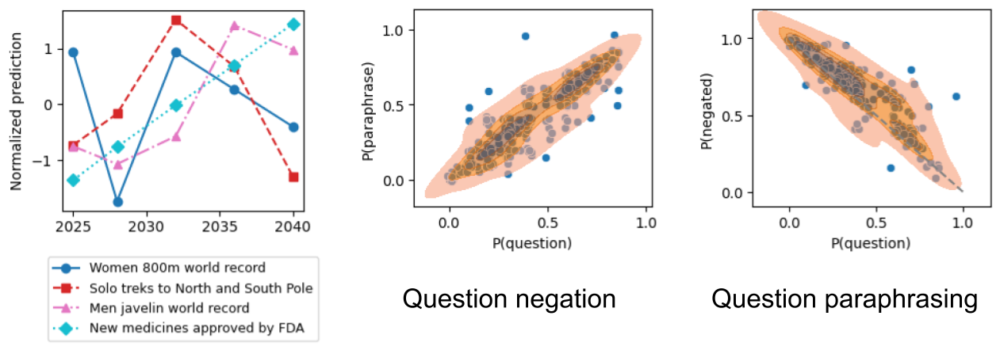

# superhuman-ai-consistency

This repository contains the code for the paper [Evaluating Superhuman Models with Consistency Checks](https://arxiv.org/TODO) by [Lukas Fluri](https://www.linkedin.com/in/lukas-fluri-0b4721112), [Daniel Paleka](https://danielpaleka.com/), and [Florian Tramèr](https://floriantramer.com/).

## tl;dr
If machine learning models were to achieve *superhuman* abilities at various reasoning or decision-making tasks,
how would we go about evaluating such models, given that humans would necessarily be poor proxies for ground truth?

In this paper, we propose a framework for evaluating superhuman models via *consistency checks*.
Our premise is that while the *correctness* of superhuman decisions may be impossible to evaluate, we can still surface mistakes if the model's decisions fail to satisfy certain logical, human-interpretable rules.

We instantiate our framework on three tasks where correctness of decisions is hard to evaluate due to either superhuman model abilities, or to otherwise missing ground truth: evaluating chess positions, forecasting future events, and making legal judgments.

We show that regardless of a model's (possibly superhuman) performance on these tasks, we can discover logical inconsistencies in decision making. 
For example: a chess engine assigning opposing valuations to semantically identical boards; GPT-4 forecasting that sports records will evolve non-monotonically over time; or an AI judge assigning bail to a defendant only after we add a felony to their criminal record.

The code for our experiments is available in the following directories:

- [RL testing](./chess-ai-testing): Code and data which were used for testing chess AIs for inconsistencies.
- [LLMs forecasting future events](https://github.com/ethz-privsec/superhuman-ai-consistency/releases/tag/v1.0.0): Experimental data produced by GPT-4 and GPT-3.5.
- [Legal AI testing](./legal-ai-testing): Code and data which were used for testing legal AIs for inconsistencies.

**_Note:_** Our data files are not part of the git repository. Instead, they are packaged in [release v1.0.0](https://github.com/ethz-privsec/superhuman-ai-consistency/releases/tag/v1.0.0).

## Chess AI experiments

Game-playing AIs are a prime example of models that operate vastly beyond human levels. We focus on chess, a canonical example of a complex decision-making task where humans can easily evaluate end-to-end performance (i.e., did the model win?), but not individual model decisions. 
Nevertheless, the rules of chess imply several simple invariances that are readily apparent and verifiable even by amateur players --- a perfect application for our framework.

In our experiments we test [Leela Chess Zero](https://github.com/LeelaChessZero/lc0), an open-source chess engine which plays at a superhuman level. We find large violations of various consistency constraints:
- **Forced moves:** For board positions where there's only a single legal move, playing this move has no impact on the game’s outcome. Hence, the positions before and after the forced move must have the same evaluation.
- **Board transformations:** For positions without pawns and castling, any change of orientation of the board (like board rotations or mirroring the board over any axis) has no effect on the game outcome.
- **Position mirroring:** Mirroring the players’ position, such that White gets the piece-setup of Black and vice versa,
with the rest of the game state fixed (e.g., castling rights), must results in a semantically identical position
- **Recommended move:** The model’s evaluation of a position should remain similar if we play the strongest move predicted by
the model. Indeed, chess engines typically aim to measure the expected game outcome under optimal play from both players, so any optimal move should not affect this measure.

The code for our experiments is available in the [chess-ai-testing](./chess-ai-testing) directory. The data files are available in [release v1.0.0](https://github.com/ethz-privsec/superhuman-ai-consistency/releases/tag/v1.0.0).

## LLMs forecasting future events

Predicting and modeling the future is an important task for which the ground truth is inherently unknown: as the saying goes, "*it is difficult to make predictions, especially about the future.*"

In our experiments we test [GPT-4](https://arxiv.org/abs/2303.08774) and [gpt-3.5-turbo](https://openai.com/blog/chatgpt) on their ability to forecast future events and give probability estimates for whether the events happen.

We find large violations of various consistency constraints: 
- **Negation:** For any event A, the model should predicts opposite probabilities for A and ¬A;
- **Paraphrasing:** The model should predict the same probability for multiple equivalent events;
- **Monotonicity:** Numbers or quantities which are known to be monotonic in time, such as sports records or numbers of people accomplishing a given feat, have monotonic model prediction;
- **Bayes' rule:** For two events A and B, the model's probability forecasts for the events A, B, A | B and B | A satisfy Bayes' theorem.

The benchmark questions and model responses are available in [release v1.0.0](https://github.com/ethz-privsec/superhuman-ai-consistency/releases/tag/v1.0.0).

## Legal AI experiments

Reaching decisions on complex legal cases can be long and costly, and the "correctness" of decisions is often contested (e.g., as evidenced by appeal courts). 
The difficulties in assessing the correctness or fairness of legal decisions extend to AI tools that are used to assist or automate legal decisions. 

We show how to reveal clear logical inconsistencies in two different language models used for predicting legal verdicts: (1) a [BERT model that evaluates violations of the European Convention of Human Rights](https://huggingface.co/nlpaueb/legal-bert-base-uncased); (2) [gpt-3.5-turbo](https://openai.com/blog/chatgpt) prompted to predict bail decisions given a defendant's criminal record.

In particular, we show violations of the following consistency constraints:
- **Paraphrasing:** We test whether changing the phrasing of a legal case changes the model’s decision.
- **Partial ordering:** While the "correctness" of legal decisions is hard to assess, there can still be clear
ways of “ranking” different outcomes. We consider an extreme example here, where we test whether
a bail-decision model could favorably switch its decision if the defendant commits more crimes.

The code for our experiments is available in the [legal-ai-testing](./legal-ai-testing) directory. The data files are available in [release v1.0.0](https://github.com/ethz-privsec/superhuman-ai-consistency/releases/tag/v1.0.0)..
